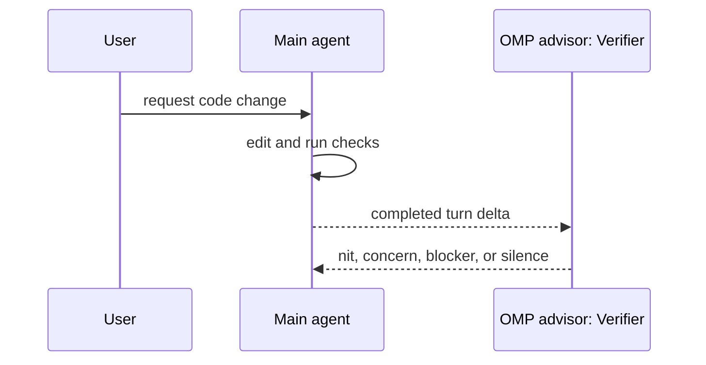

# Concepts

OMP Verifier is small on purpose.

## Product shape

The only runtime feature is advisor injection:

1. `WATCHDOG.md` holds reusable verifier guidance.
2. `/verifier install` creates project-local OMP advisor files.
3. `/verifier uninstall` removes generated verifier advisor files when safe.
4. Downstream repos customize `WATCHDOG.yml` with local setup, test, service, database, and browser rules.
5. Reinstalling this plugin refreshes upstream verifier guidance without overwriting downstream customization.

No task agents, PR checkout, app booting, GitHub comments, planning tools, or custom OMP runtime live here.

## Runtime flow



## Command contract

`/verifier install` writes in the current repo only:

- `.omp/config.yml` when absent, enabling `advisor.enabled` without setting a model.
- `WATCHDOG.yml`, defining a named `Verifier` advisor that imports `@~/.omp/plugins/node_modules/omp-verifier/WATCHDOG.md`.

`/verifier install --force` refreshes only `WATCHDOG.yml`; existing `.omp/config.yml` is preserved.

`/verifier uninstall` removes generated files only when they still match the generated content. Customized files are preserved.

`/verifier uninstall --force` removes customized `WATCHDOG.yml`, but still preserves customized `.omp/config.yml`.

## Install lessons

Local development should use a linked checkout:

```bash
omp plugin link ~/code/klondikemarlen/omp-verifier
```

Private GitHub remote installs should use explicit SSH pinned to a commit:

```bash
omp plugin install git+ssh://git@github.com/klondikemarlen/omp-verifier.git#<commit>
```

Avoid `github:klondikemarlen/omp-verifier` for this private repo. Bun resolves that shorthand through GitHub's tarball path, which is not reliable for private repositories.

Observed failure mode: Bun resolved `#v0.1.1` and `#refs/tags/v0.1.1` as missing despite the remote tag existing. Commit pins installed the expected package, so release verification uses the commit hash plus `package.json` version.

## Release flow

A release is a GitHub plugin release, not an npm or Marketplace publish.

1. Update code, docs, tests, `package.json` version, and `CHANGELOG.md`.
2. Run `npm run release:check`.
3. Commit with the style in `COMMITTING.md`.
4. Push `main`.
5. Tag the committed version with `v<package.json version>` and push the tag.
6. Run `omp plugin uninstall omp-verifier && npm run reinstall` from the pushed commit.
7. Confirm installed `.bun-tag`, `package.json` version, file tree, and `/verifier info`.
