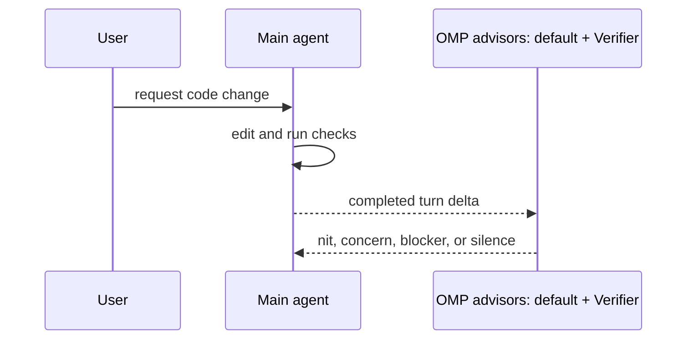

# Concepts

OMP Verifier is small on purpose.

## Product shape

The only runtime feature is advisor injection:

1. `WATCHDOG.md` holds reusable verifier guidance.
2. `/verifier install` creates project-local OMP advisor files.
3. `/verifier uninstall` removes generated verifier advisor files when safe.
4. Downstream repos customize `WATCHDOG.yml` with local setup, test, service, database, and browser rules.
5. Reinstalling this plugin refreshes upstream verifier guidance without overwriting downstream customization.

No task agents, PR checkout, app booting, GitHub comments, planning tools, or custom OMP runtime live here.

## Runtime flow



## Command contract

`/verifier install` writes in the current repo by default:

- `.omp/config.yml` when absent, enabling `advisor.enabled` without setting a model.
- `WATCHDOG.yml`, configuring the default advisor with verifier guidance from `@~/.omp/plugins/node_modules/omp-verifier/WATCHDOG.md`.

`/verifier install global` writes only `<active agent dir>/WATCHDOG.yml`; it does not edit global `config.yml`.

Re-running `/verifier install` creates or migrates verifier-generated `WATCHDOG.yml` files only; customized `WATCHDOG.yml` files and existing `.omp/config.yml` are preserved.

`/verifier uninstall` removes verifier-generated `WATCHDOG.yml` files only. Project-local `.omp/config.yml` is removed only when it still matches the generated content.

## Install lessons

Local development should use a linked checkout:

```bash
omp plugin link ~/code/klondikemarlen/omp-verifier
```

Public GitHub remote installs should use the GitHub plugin source pinned to a tag or commit:

```bash
omp plugin install github:klondikemarlen/omp-verifier#<tag-or-commit>
```

Historical note: earlier restricted-access installs needed explicit SSH commit pins because GitHub tarball resolution was unreliable for tags. This repository is public, so public install docs should use the GitHub plugin source.

## Public package surface

The shipped OMP plugin surface is the `package.json` `files` list: repository docs, `WATCHDOG.md`, `omp-plugin/`, and `package.json`. Public-release audits should inspect that package surface for secrets, credentials, restricted-repository assumptions, and local-only paths before tagging.

## Release flow

A release is a GitHub plugin release, not an npm or Marketplace publish.

1. Update code, docs, tests, `package.json` version, and `CHANGELOG.md` on a feature branch.
2. Run `npm run release:check`.
3. Commit with the style in `COMMITTING.md`.
4. Push the branch, open a linked PR, review it, and merge it to `main`.
5. Tag the merged version with `v<package.json version>` and push the tag.
6. Reinstall from the public GitHub source with `npm run reinstall`; public installs use `github:klondikemarlen/omp-verifier#<commit>` and do not need SSH.
7. Confirm installed `.bun-tag`, `package.json` version, file tree, and `/verifier status`.
