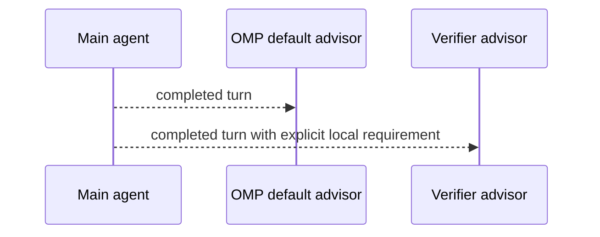

# Concepts

## Product shape

OMP Verifier is a second advisor, not a replacement for OMP's default advisor.

The user-level `WATCHDOG.yml` always keeps `default` first. The plugin inserts and owns only its marked `verifier` block immediately after `default`; independent advisors remain untouched.

`default` receives OMP's stock advisor prompt. `verifier` imports this repository's `WATCHDOG.md` and evaluates only explicit verifier requirements. Generic quality, scope, strategy, and direct-risk concerns remain with `default`.

## Lifecycle

- Loading the plugin reconciles the user roster to `default`, then marked `verifier`.
- `/verifier status` reports global and project roster entries.
- `/verifier uninstall` removes only the marked verifier block.
- The plugin does not create configuration files, local-rules templates, task agents, or custom runtimes.

## Requirement contract

A project requirement belongs in a project `WATCHDOG.yml` `verifier` entry. It must name its trigger, Gold condition, narrow check, and PASS evidence.

The verifier classifies applicable evidence as PASS, FAIL, or BLOCKED. PASS stays silent. FAIL and BLOCKED cite the requirement and the smallest next check.

## Release

Run `npm run release:check`, merge the reviewed pull request, tag the version, then run `npm run reinstall` and verify the installed package version.
