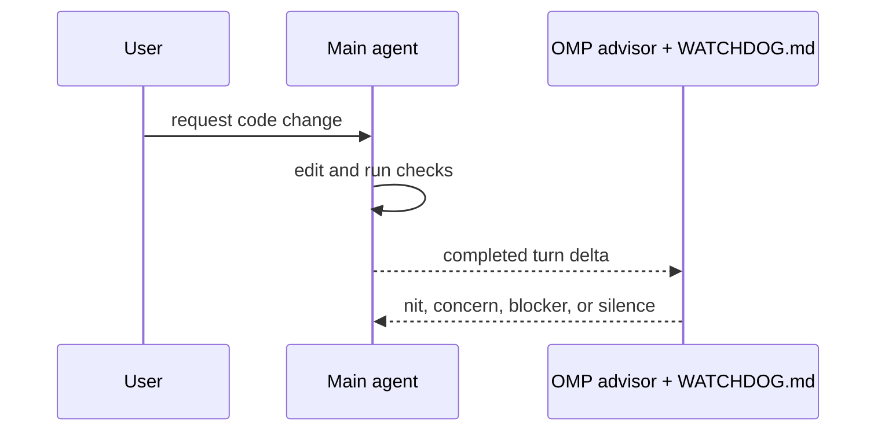
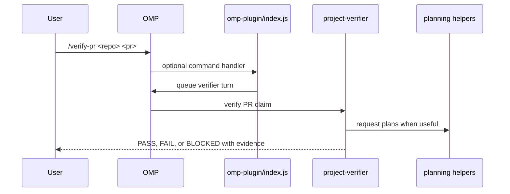

# Concepts

## Intent

**WHY this document exists:** The verifier plugin is small on purpose. Future changes need to preserve the split between agent prompts, OMP command wiring, pure planning helpers, and real external side effects.

**WHAT this document produces:** A compact map of the verifier workflow, install lessons, release flow, and current runtime limits.

**Decision Rules:**
- **Gold first:** define what success would prove before running checks.
- **Evidence beats summaries:** PASS requires observed command output, browser QA, screenshots, URLs, or other reproducible evidence.
- **Planning is not execution:** `verify_pr_plan`, `boot_app_plan`, and `format_pr_comment` return plans/text only. They do not boot apps or post PR comments.
- **One verifier before orchestration:** keep one specialized verification flow working before adding swarms, schedulers, or PR automation.
- **Local link for development:** use `omp plugin link` while editing; use remote SSH install only to verify packaged loading.

## Problem shape

A normal implementation agent is optimized to change code. A verifier agent is optimized to distrust the claim until the smallest useful check proves it.

This package supplies that verifier layer in three tiers:

1. `WATCHDOG.md` provides advisor-style rules for always-on review through OMP's built-in advisor runtime.
2. Agent prompts in `agents/` define explicit verifier subagent behavior.
3. The OMP extension in `omp-plugin/` registers optional slash-command sugar and pure planning tools.
4. Helpers in `tools/` build plans and comment text without touching GitHub, browsers, or app processes.

Current OMP caveat: this package does not install a custom `omp-verifier` advisor runtime or settings role. Always-on behavior uses the built-in OMP advisor plus `WATCHDOG.md`; a dedicated verifier role would need upstream OMP support.

## Relationship to Marlen's skills

This plugin is the verifier-focused OMP layer for the generic conventions in [Marlen's Skills, Rules, and Tools](https://github.com/klondikemarlen/marlens-skills-rules-and-tools).

That package remains the base layer for reusable agent workflows, commit style, feature flow, release notes, testing instructions, and project-local precedence. This package adds the verification-specific agent prompts, command handoff, and planning helpers.

The same precedence rule applies here: generic verifier guidance lives in this repo; project-specific commands, services, database vendors, code style, and domain terms live in the target project.

## Runtime flow

Always-on advisor flow:



Explicit verifier subagent flow:



## Command contract

`/verify-pr <repo> <pr-number>` starts a verifier turn. It does not check out the PR by itself.

The generated verifier instruction requires the agent to:

1. Start from Gold.
2. Inspect the PR diff/current state.
3. Create or reuse an isolated worktree when verification needs one.
4. Derive PR-specific ports/env before booting services.
5. Run targeted tests or browser QA.
6. Report `PASS`, `FAIL`, or `BLOCKED` with evidence.

## Tool contracts

- `verify_pr_plan`: returns a text plan for evidence-first PR verification.
- `boot_app_plan`: returns deterministic PR-specific port/env values. It does not start services.
- `format_pr_comment`: returns Markdown for a verifier PR comment. It does not post to GitHub.

This keeps side effects explicit. When real app booting or PR posting is added, it should live behind dedicated tools with tests and clear failure modes.

## Install lessons

Local development should use a linked checkout:

```bash
omp plugin link ~/code/klondikemarlen/omp-verifier
```

Private GitHub remote installs should use explicit SSH:

```bash
omp plugin install git+ssh://git@github.com/klondikemarlen/omp-verifier.git
```

Avoid using `github:klondikemarlen/omp-verifier` for this private repo. Bun resolves that shorthand through GitHub's tarball path, which is not reliable for private repositories.

If switching an existing install between source forms or versions, reset the installed plugin first:

```bash
omp plugin uninstall omp-verifier
omp plugin install git+ssh://git@github.com/klondikemarlen/omp-verifier.git --force
```

The package version is release metadata. It does not choose the git ref by itself, so release verification must check the installed `package.json` version and file tree after reinstall.

## Release flow

A release is a GitHub plugin release, not an npm or Marketplace publish.

1. Update code, docs, tests, `package.json` version, and `CHANGELOG.md`.
2. Run `npm run release:check`.
3. Commit with the style in `COMMITTING.md`.
4. Push `main`.
5. In a fresh OMP session, run `omp plugin uninstall omp-verifier && npm run reinstall`.
6. Confirm the installed `package.json` version matches the pushed repo.
7. Confirm the installed tree contains the pushed files, including `CONCEPTS.md`, `WATCHDOG.md`, `agents/project-verifier.md`, and `omp-plugin/index.js`.
8. Run `/verifier-info` or `/verify-pr <repo> <pr>` to confirm the installed plugin loads.

## Current limits

- No app process is booted automatically.
- No GitHub PR comment is posted automatically.
- No PR checkout/worktree command is implemented yet.
- Agent files can describe verification policy, but the task tool must discover plugin-shipped agents in the running OMP version.
- The verifier still depends on the acting agent to choose and run the targeted checks.
