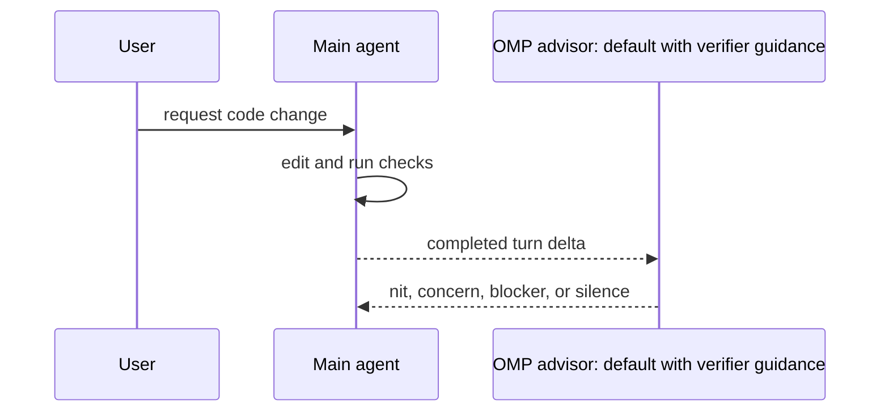

# Concepts

OMP Verifier is small on purpose.

## Product shape
The only runtime feature is advisor injection:

1. `WATCHDOG.md` holds reusable verifier guidance shipped by this plugin.
2. Loading the plugin creates or refreshes user-level `WATCHDOG.yml` and `WATCHDOG.local.md`.
3. Generated `WATCHDOG.yml` imports the shipped guidance and local rules; customized local rules are preserved.
4. `/verifier status` reports the active global and project verifier setup.
5. The plugin uninstall lifecycle removes generated verifier files when supported, while preserving customized files.
6. Reinstalling this plugin refreshes upstream verifier guidance without overwriting downstream customization.

No task agents, PR checkout, app booting, GitHub comments, planning tools, or custom OMP runtime live here.

## Runtime flow



## Command contract

The only manual command is `/verifier status`; install the plugin through OMP:

```bash
omp plugin install github:klondikemarlen/omp-verifier#<tag-or-commit>
```

When the plugin loads, it writes these files under the active OMP agent directory:

- `WATCHDOG.yml`, containing the generated default-advisor wrapper.
- `WATCHDOG.local.md`, containing downstream-specific setup, test, service, database, browser, and definition-of-done rules.

The plugin does not edit global OMP runtime configuration. Configure advisor tools, model, and runtime behavior in local OMP configuration.

Re-running the plugin refreshes generated `WATCHDOG.yml` and generated `WATCHDOG.local.md` files only. Customized files are preserved.

`omp plugin uninstall omp-verifier` removes generated verifier files when OMP supports plugin uninstall lifecycle hooks. Customized files are preserved.

## Install lessons

Local development should use a linked checkout:

```bash
omp plugin link ~/code/klondikemarlen/omp-verifier
```

Public GitHub remote installs should use the GitHub plugin source pinned to a tag or commit:

```bash
omp plugin install github:klondikemarlen/omp-verifier#<tag-or-commit>
```

Historical note: earlier restricted-access installs needed explicit SSH commit pins because GitHub tarball resolution was unreliable for tags. This repository is public, so public install docs should use the GitHub plugin source.

## Public package surface

The shipped OMP plugin surface is the `package.json` `files` list: repository docs, `WATCHDOG.md`, `omp-plugin/`, and `package.json`. Public-release audits should inspect that package surface for secrets, credentials, restricted-repository assumptions, and local-only paths before tagging.

## Release flow

A release is a GitHub plugin release, not an npm or Marketplace publish.

1. Update code, docs, tests, `package.json` version, and `CHANGELOG.md` on a feature branch.
2. Run `npm run release:check`.
3. Commit with the style in `COMMITTING.md`.
4. Push the branch, open a linked PR, review it, and merge it to `main`.
5. Tag the merged version with `v<package.json version>` and push the tag.
6. Reinstall from the public GitHub source with `npm run reinstall`; public installs use `github:klondikemarlen/omp-verifier#<commit>` and do not need SSH.
7. Confirm installed `.bun-tag`, `package.json` version, file tree, and `/verifier status`.
