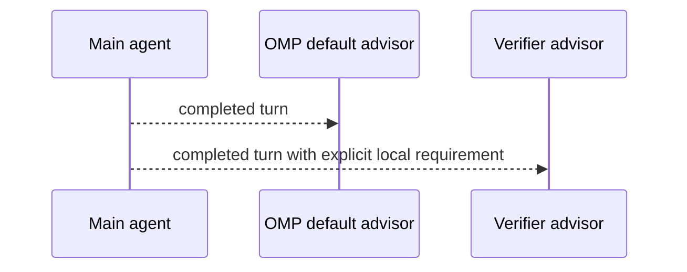

# Concepts

## Product shape

OMP Verifier is a second advisor, not a replacement for OMP's default advisor.


```mermaid
sequenceDiagram
  participant Main as Main agent
  participant Default as OMP default advisor
  participant Verifier as Verifier advisor

  Main-->>Default: completed turn
  Main-->>Verifier: completed turn with explicit local requirement
```

The user-level `WATCHDOG.yml` always keeps `default` first. The plugin inserts and owns only its marked `verifier` block immediately after `default`; independent advisors remain untouched.

`default` receives OMP's stock advisor prompt. On every setup, `verifier` copies this repository's `WATCHDOG.md` to `<agent-dir>/verifier/WATCHDOG.md` and imports that agent-owned generated file. Generic quality, scope, strategy, and direct-risk concerns remain with `default`.

## Lifecycle

- Loading the plugin refreshes the agent-owned guidance file and reconciles the user roster to `default`, then marked `verifier`.
- `/verifier status` reports global and project roster entries plus the guidance-file path.
- `/verifier uninstall` removes only the marked verifier block and unchanged guidance file.
- The plugin does not create configuration files, local-rules templates, or task agents; its optional manifest runner only executes explicitly declared package-relative verification modules.

## Requirement contract

A project requirement belongs in a project `WATCHDOG.yml` `verifier` entry. It must name its trigger, Gold condition, narrow check, and PASS evidence.

The verifier classifies applicable evidence as PASS, FAIL, or BLOCKED. PASS stays silent. FAIL and BLOCKED cite the requirement and the smallest next check.

## Verification capability direction

The plugin remains an independent advisor and does not require an OMP-core API. Installed OMP plugins can opt into deterministic verification by declaring package metadata; `omp-verifier` discovers that metadata when its commands run. Packages are eligible when they expose either `omp.extensions` or `pi.extensions`; verification declarations live under `omp.verifications`.

## Manifest contract

An installed plugin package may declare:

```json
{
  "omp": {
    "extensions": ["./omp-plugin/index.js"],
    "verifications": [{
      "id": "publisher:check-id",
      "label": "Human label",
      "description": "What the check proves",
      "entry": "./verifications/check-id.mjs",
      "timeoutMs": 30000
    }]
  }
}
```

Each verification entry is a package-relative `.mjs` module. The verifier executes it with the active project as its working directory and expects one JSON result:

```json
{
  "status": "PASS",
  "summary": "The requirement is satisfied",
  "evidence": "Observed evidence",
  "nextCheck": "Optional smallest follow-up check"
}
```

`PASS`, `FAIL`, and `BLOCKED` are the only valid statuses. Invalid manifests, duplicate IDs, path traversal, missing entries, timeouts, non-zero exits, oversized output, malformed JSON, and missing prerequisites fail closed as `BLOCKED`; none may become `PASS`.

“All checks” means all valid checks explicitly declared by installed plugin manifests. It does not mean scanning remote repositories, guessing from tool names, or running package-maintainer `scripts/verify-*.mjs` files. Verification entries are trusted installed code, not a sandbox; the verifier accepts no model-supplied command or executable path.

The public commands are:

```text
/verifier checks
/verifier verify
/verifier verify <check-id...>
```

With no compatible manifests installed, `/verifier checks` reports `none installed` and `/verifier verify` returns `BLOCKED`. Existing `/verifier`, `/verifier status`, `/verifier uninstall`, advisor setup, and guidance ownership remain independent of this optional capability.

## Learner promotion path

`omp-learner` captures high-confidence style and concept feedback in OMP memory and reviewable tickets. It must not silently turn an observation into executable policy. The intended promotion path is:

```text
user correction or repeated feedback
  -> learner memory and/or reviewable ticket
  -> accepted shared rule or project rule
  -> explicit deterministic manifest or agentic verifier guidance
  -> verifier evidence
```

Deterministic checks belong in manifests when a rule has a bounded, reproducible signal. Subjective readability, architecture, and concept checks remain agentic guidance and require changed-file evidence plus a concrete local rule or example.

## Related feature tickets

- `klondikemarlen/omp-verifier#82` — consume installed plugin verification manifests.
- `klondikemarlen/marlens-skills-rules-and-tools#227` — expose reusable Marlen-specific checks.
- `klondikemarlen/omp-learner#99` — promote accepted lessons into reviewable verifier-check proposals.

## Release

Run `npm run release:check`, merge the reviewed pull request, tag the version, then run `npm run reinstall` and verify the installed package version.
