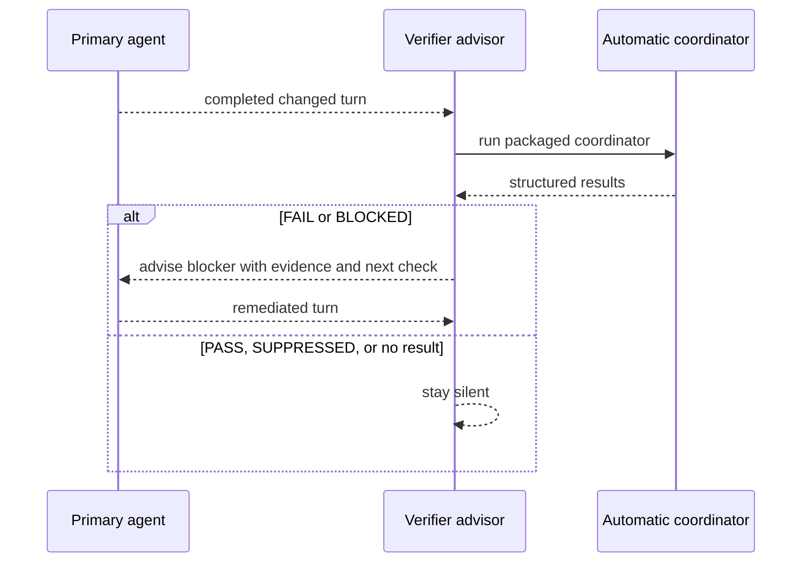

# OMP Verifier Concepts Reference

## Product Shape

OMP Verifier is a second advisor, not a replacement for OMP's default advisor.



The user-level `WATCHDOG.yml` always keeps `default` first. The plugin inserts and owns only its marked `verifier` block immediately after `default`; independent advisors remain untouched.

`default` receives OMP's stock advisor prompt. On every setup, `verifier` copies this repository's `WATCHDOG.md` to `<agent-dir>/verifier/WATCHDOG.md`, substitutes the coordinator path derived from the installed package, and imports that generated file. The generated verifier advisor receives `bash`; generic quality, scope, strategy, and direct-risk concerns remain with `default`.

## Lifecycle

- Loading the plugin refreshes the agent-owned guidance file and reconciles the user roster to `default`, then marked `verifier`.
- After a changed turn, the verifier advisor invokes the packaged automatic coordinator. The plugin has no `agent_end` notification runner.
- `/verifier status` reports global and project roster entries plus the guidance-file path.
- `/verifier uninstall` removes only the marked verifier block and unchanged guidance file.
- The plugin does not create project configuration, local-rules templates, task agents, daemons, or custom agent loops.

## Requirement Contract

A project requirement belongs in a project `WATCHDOG.yml` `verifier` entry. It must name its trigger, Gold condition, narrow check, and PASS evidence.

The verifier classifies applicable evidence as `PASS`, `FAIL`, `BLOCKED`, or scoped `SUPPRESSED`. `PASS`, `SUPPRESSED`, and no applicable results stay silent. `FAIL` and `BLOCKED` produce standard OMP blocker advice with the check id, evidence, and smallest next check.

## Verification Capability Direction

The plugin remains an independent advisor and does not require an OMP-core API. Installed OMP plugins opt into deterministic verification through package metadata. The package-local `automatic` coordinator handles selection and execution; the advisor owns interpretation and corrective delivery. Packages are eligible when they expose either `omp.extensions` or `pi.extensions`; verification declarations live under `omp.verifications`.

## Manifest Contract

An installed plugin package may declare:

```json
{
  "omp": {
    "extensions": ["./omp-plugin/index.js"],
    "verifications": [{
      "id": "publisher:check-id",
      "label": "Human label",
      "description": "What the check proves",
      "entry": "./verifications/check-id.mjs",
      "timeoutMs": 30000
    }]
  }
}
```

Each verification entry is a package-relative `.mjs` module. The verifier executes it with the active project as its working directory and expects one JSON result:

```json
{
  "status": "PASS",
  "summary": "The requirement is satisfied",
  "evidence": "Observed evidence",
  "nextCheck": "Optional smallest follow-up check"
}
```

`PASS`, `FAIL`, and `BLOCKED` are the only valid statuses. Invalid manifests, duplicate IDs, path traversal, missing entries, timeouts, non-zero exits, oversized output, malformed JSON, and missing prerequisites fail closed as `BLOCKED`; none may become `PASS`.

“All checks” means all valid checks explicitly declared by installed plugin manifests. It does not mean scanning remote repositories, guessing from tool names, or running package-maintainer `scripts/verify-*.mjs` files. Verification entries are trusted installed code, not a sandbox; the verifier accepts no model-supplied command or executable path.

The public commands are:

```text
/verifier checks
/verifier verify
/verifier verify <check-id...>
```

With no compatible manifests installed, `/verifier checks` reports `none installed` and `/verifier verify` returns `BLOCKED`. Existing `/verifier`, `/verifier status`, `/verifier uninstall`, advisor setup, and guidance ownership remain independent of this optional capability.

## Discovery and Execution Inputs

The plugin's command adapter takes the active project directory and OMP's verification-package directory from the session context. The coordinator derives its default installed-package directory from the installed Verifier package or `PI_CODING_AGENT_DIR`.

Discovery prefers the plugin manager registry at the parent `package.json` when it is named `omp-plugins` and has an object-valued `dependencies` field; otherwise it scans direct and scoped package directories. A candidate must expose an `omp.extensions` or `pi.extensions` entry and declare `omp.verifications`. Verifier does not scan remote repositories, project source trees, arbitrary `verify-*` scripts, or undeclared package entries.

Each manifest entry has a namespaced lowercase `id`, `label`, `description`, package-relative `.mjs` `entry`, and optional non-empty `pathTriggers` and bounded `timeoutMs` (30 seconds by default, at most 120 seconds). The entry must remain inside its package, including after resolving symlinks. The runner executes the trusted installed entry with `node`, no shell, and the active project as its working directory.

Selection differs by interface:

- `/verifier checks` lists valid installed checks and any manifest discovery blocks.
- `/verifier verify` runs every discovered check; `/verifier verify <id...>` runs only those exact IDs. `pathTriggers` do not restrict explicit runs. With no checks installed, `verify` reports `BLOCKED`.
- The automatic coordinator receives only the paths changed by the current agent turn, as project-relative arguments. It runs only checks with a matching `pathTriggers` pattern and records each selected changed path plus its matched trigger. Checks without triggers are manual-only. `automatic --worktree` is a separate explicit mode that derives all current Git-worktree changes.

Automatic entries receive their matching paths as the `OMP_VERIFIER_CHANGED_PATHS` JSON-array environment variable. The runner removes any inherited value first; manual checks do not receive the variable. Other environment variables are inherited. The coordinator applies bounded suppressions from `.omp-verifier.json` at the repository root or an affected path's ancestor. A suppression names an installed check, a path relative to its config file, and a reason; an optional `expires` date must be valid and not expired. Invalid or expired suppressions and references to unknown check IDs produce `BLOCKED`, not silent suppression.

## Result and Evidence Semantics

An entry writes one JSON object to stdout with a required `status` (`PASS`, `FAIL`, or `BLOCKED`) and non-empty `summary`; `evidence` and `nextCheck` are optional. The runner bounds output and text fields, validates the shape, and enforces the manifest timeout. Malformed output, stderr, timeout, missing entry, invalid manifest, or other unsuccessful execution cannot become `PASS`. A structured `FAIL` is retained when the result is valid and stderr is empty, including on a non-zero process exit; other non-zero exits are `BLOCKED`.

Each result is normalized with an `id`, `status`, and `summary`, plus optional `evidence` and `nextCheck`; automatic selected or suppressed results include `matches` objects carrying changed `path` and matched `trigger` fields.

| Outcome | Meaning and Verifier behavior |
| --- | --- |
| `PASS` | The declared check reported its Gold condition met. Verifier validates and relays that result; it does not independently prove the condition or certify overall code quality. |
| `FAIL` | The declared check reported a violation. Automatic advisor guidance turns it into standard `blocker` advice with the check ID, evidence, and smallest next check. |
| `BLOCKED` | The check could not establish PASS/FAIL, or discovery/execution/result validation failed. Automatic advisor guidance treats it as a blocker with the available evidence and next check. |
| `SUPPRESSED` | Verifier matched a valid bounded suppression and did not run the check for that path. This is not a PASS; automatic guidance stays silent. |
| No result | No automatic check applied (or there were no changed paths). This is not a PASS; automatic guidance stays silent. |

Automatic CLI output is a JSON result array and exits `1` if any result is `FAIL` or `BLOCKED`, otherwise `0`; invalid CLI usage exits `2`. `/verifier checks` and `/verifier verify` display human-readable notifications instead of that CLI JSON/exit contract.

**Interpretation limit:** PASS from a narrow manifest check proves only that the check entry returned a valid PASS result for its declared contract. It is not a code-quality certification, an approval of unrelated behavior, or proof that generic review concerns were checked.

## Ownership Boundaries

- **OMP Verifier** owns the adapter and runtime contract: its marked advisor setup/cleanup, commands, manifest discovery and validation, path-trigger selection, bounded suppression, trusted entry execution, evidence normalization, and verifier-advisor correction guidance.
- **A policy/check-owning package** owns the check's Gold condition and implementation. [Marlens Skills, Rules, and Tools (MSSRT)](https://github.com/klondikemarlen/marlens-skills-rules-and-tools) owns reusable Marlen coding guidance and its generic deterministic checks; an installed manifest opts a specific package-owned `.mjs` check into Verifier. Verifier does not invent generic policy or infer checks from prose, filenames, or tool names.
- **A project** owns its explicit local verifier requirement in project `WATCHDOG.yml` and any project-specific check package. Requirements name a trigger, Gold condition, narrow check, and PASS evidence.
- **OMP's default advisor** retains generic code quality, robustness, strategy, scope, and direct-risk review. Verifier is a distinct evidence/check advisor and must not duplicate that broad review.
- **OMP advisor runtime and configuration** own model resolution, scheduling, and actual advisor interaction with the primary agent. Verifier does not choose or rewrite model/provider routes; live correction claims require the verifier model to resolve and an observed blocker/remediation cycle.
- **OMP Learner** (the [OMP Learner repository](https://github.com/klondikemarlen/omp-learner)) owns high-confidence feedback classification and the human-reviewed proposal route for accepted lessons. Learning an observation does not silently create or activate verifier policy.

The collaboration path is therefore: OMP Learner may surface a reviewable lesson; its intended policy owner (for reusable Marlen guidance, MSSRT) accepts and implements a rule/check; the package declares its check; Verifier selects and executes it and presents evidence; OMP's advisor runtime delivers the correction interaction.

## Implementation and Proof Map

| Contract | Implementation source | Focused evidence |
| --- | --- | --- |
| Advisor command registration, completion, human-readable command output, and session setup entry | [`omp-plugin/index.js`](../../omp-plugin/index.js#L55) | [`test/verifier-plugin.test.js`](../../test/verifier-plugin.test.js#L18) covers registered commands, completion, handlers, and setup. |
| Marked global roster block and generated guidance lifecycle | [`omp-plugin/global-verifier.js`](../../omp-plugin/global-verifier.js#L149) | [`test/verifier-plugin.test.js`](../../test/verifier-plugin.test.js#L300) covers setup, preserving independent advisors, status, cleanup, and customized guidance. |
| Registry/fallback discovery, manifest validation, execution and result normalization, path triggers, and suppressions | [`omp-plugin/verifications.js`](../../omp-plugin/verifications.js#L161) | [`test/verifier-plugin.test.js`](../../test/verifier-plugin.test.js#L27) exercises declared-registry discovery, malformed/duplicate/unsafe manifests and results, path selection, suppressions, and slash-command output. |
| Automatic coordinator arguments, JSON output, and process exit status | [`bin/omp-verifier.js`](../../bin/omp-verifier.js#L4) | [`test/verifications-runtime.test.js`](../../test/verifications-runtime.test.js#L44) exercises empty output, explicit current-turn paths versus stale worktree paths, and Node execution. |
| Current-turn advisor input, silence/blocker policy, and evidence passed to correction guidance | [`WATCHDOG.md`](../../WATCHDOG.md#L5) | [`test/advisor-correction.test.js`](../../test/advisor-correction.test.js#L9) executes refreshed generated guidance through a real shell under a path with shell-sensitive characters and observes structured FAIL then PASS. |

These tests prove only the cases they exercise. The advisor-correction test does not run a live OMP advisor, prove model resolution, or observe primary-agent remediation. The release smoke in the [README](../../README.md#L137) requires those live observations before claiming correction behavior; `/advisor status` is the runtime-state authority.

The implementation is the authority for current behavior, tests are evidence for their explicit scenarios, and project docs describe intended contracts. A passing test suite is not proof of uncovered behavior.

## Learner Promotion Path

The [OMP Learner project](https://github.com/klondikemarlen/omp-learner) captures high-confidence style and concept feedback in OMP memory and reviewable tickets. It must not silently turn an observation into executable policy. The intended promotion path is:

```text
user correction or repeated feedback
  -> learner memory and/or reviewable ticket
  -> accepted shared rule or project rule
  -> explicit deterministic manifest or agentic verifier guidance
  -> verifier evidence
```

Deterministic checks belong in manifests when a rule has a bounded, reproducible signal. Subjective readability, architecture, and concept checks remain agentic guidance and require changed-file evidence plus a concrete local rule or example.

## Related Feature Tickets

- [OMP Verifier #82](https://github.com/klondikemarlen/omp-verifier/issues/82) — consume installed plugin verification manifests.
- [MSSRT #227](https://github.com/klondikemarlen/marlens-skills-rules-and-tools/issues/227) — expose reusable Marlen-specific checks.
- [OMP Learner #99](https://github.com/klondikemarlen/omp-learner/issues/99) — promote accepted lessons into reviewable verifier-check proposals.

## Release

Release ownership runs issue → issue-named branch → linked draft PR → complete self-review → focused QA and `npm run release:check` → resolved feedback and required checks → merge commit → synchronized `main` → remote reinstall → fresh-process installed behavior.

Advisor-correction claims additionally require a resolved verifier model in `/advisor status`, a packed or remotely installed failing-check scenario, observed verifier blocker delivery, primary-agent remediation, and a clean follow-up coordinator result. `PASS`, `SUPPRESSED`, and no results must remain silent; incomplete remediation must be checked across `advisor.immuneTurns`.
